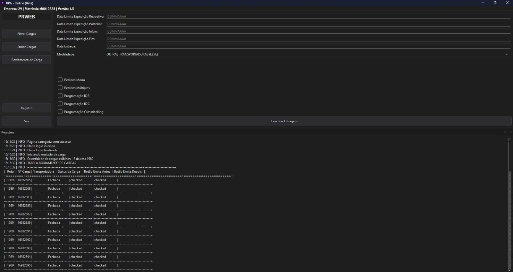

# APLICATIVO ONLINE

---

---

Aplicativo voltado a automação da programação do online,

Quando a automação devolve tempo para as pessoas

Nos últimos meses estive trabalhando em um problema bem comum em operações: a programação manual de pedidos online.

Era um processo necessário, mas pesado. Cada execução levava de 30 minutos a 1 hora e, somando todos os turnos, isso virava algo em torno de 2h30 a 3h por dia só nessa atividade.
Em períodos como a Black Friday, o impacto era ainda maior. 

Além do tempo, tinha outro ponto importante:
enquanto a programação não terminava, outras etapas da expedição ficavam travadas, gerando atrasos e mais pressão no time.

A ideia foi simples💡:
“E se esse processo rodasse sozinho, de forma confiável, e as pessoas só precisassem acompanhar?”

Foi daí que nasceu essa aplicação.
Com uma interface pensada para ser simples e direta, o fluxo que antes tomava horas passou a ser executado em até 10 minutos.
📉 Menos tarefas repetitivas
📈 Mais tempo para analisar pedidos e resolver problemas reais
🚚 Operação fluindo melhor, sem depender de etapas manuais longas

Stack🛠️
Python
Playwright
PySide6 para a interface
Pandas e NumPy para tratamento de dados

Esse projeto me lembrou de algo que às vezes a gente esquece:
automação não é sobre substituir pessoas, é sobre tirar delas o trabalho que não precisa ser manual.

Seguimos aprendendo e melhorando processos 🚀

---

Para instalar o app, rode no terminal e baixe a pasta chromium-1194 da biblioteca playwright
    pyinstaller main.py `
    --onefile `
    --windowed `
    --icon=app/assets/icons/app.ico `
    --add-data "app/assets;app/assets" `
    --add-data "app/styles;app/styles" `
    --add-data "playwright;playwright"

