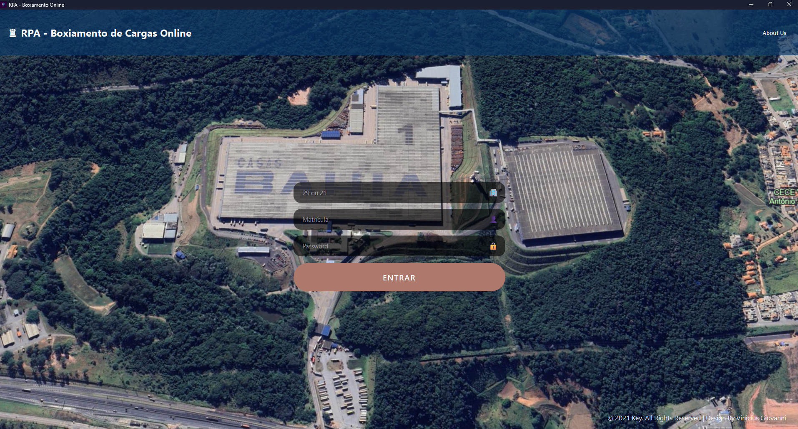
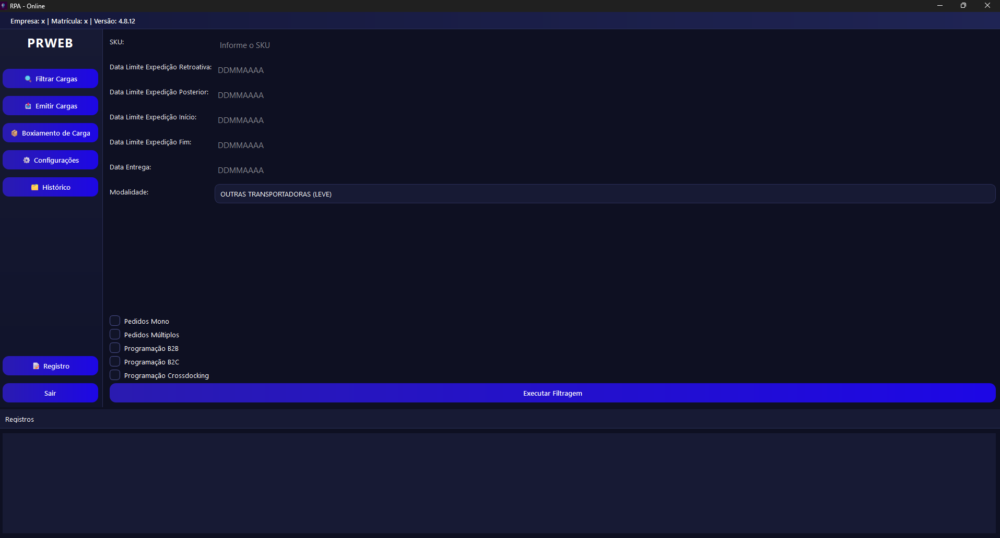
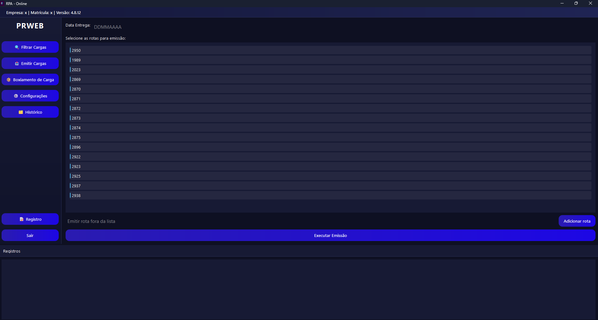
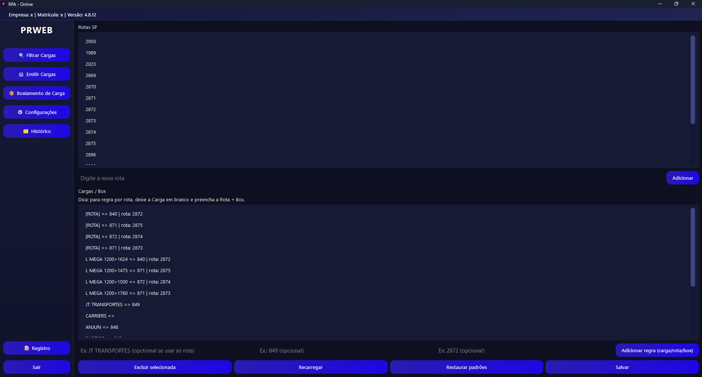
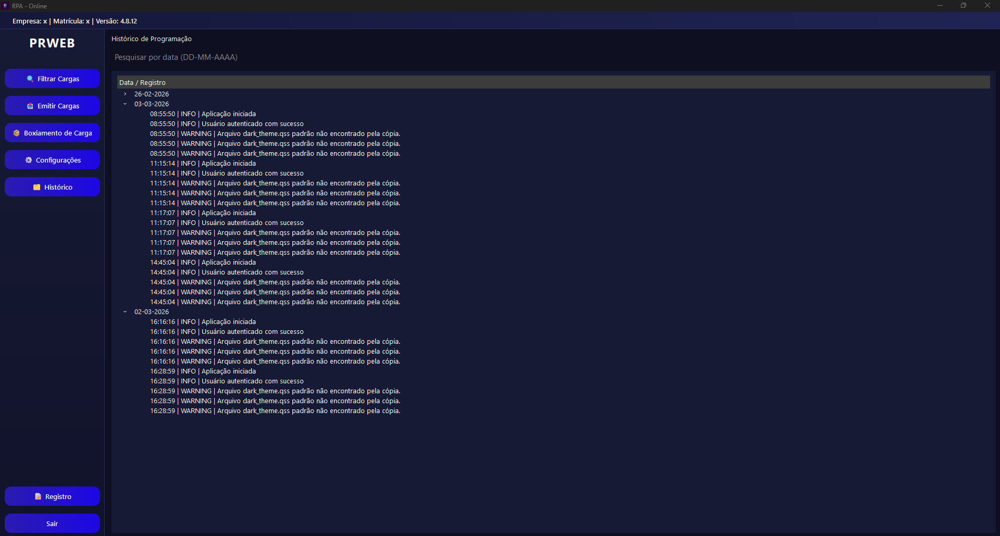
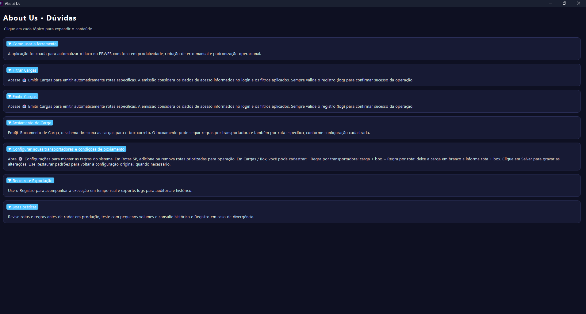

# Aplicativo Online (RPA PRWEB)

Aplicativo desktop em **Python + PySide6** para automatizar etapas operacionais no PRWEB, reduzindo tarefas manuais de programação de cargas e acelerando o fluxo logístico.

## 📌 Visão geral

O sistema transforma um processo repetitivo em uma operação guiada por interface gráfica, com execução automatizada via Playwright. Com isso, o time pode focar em análise e tomada de decisão, enquanto o aplicativo executa as etapas operacionais.

## 🧩 Funcionalidades

- Login no PRWEB com interface gráfica.
- Filtragem de cargas por data e modalidade.
- Emissão de cargas automatizada.
- Boxiamento de carga automatizado.
- Painel de logs em tempo real.
- Exportação de logs para análise operacional.
- Configuração local automática de tema e rotas.

## 🖼️ Telas principais

### Janela de login



### Filtrar Carga



### Emitir Carga



### Configurações



### Histórico



### Dúvidas



## 🧱 Estrutura do projeto

```text
aplicativo_online/
├── app/                 # Telas e componentes da UI
├── log/                 # Logging e integração com Qt
├── prweb/               # Funções de automação Playwright
├── settings/            # Configurações de app e Chromium
├── workers/             # Workers para execução em background
├── main.py              # Ponto de entrada
├── pyproject.toml       # Dependências e metadados
└── README.md
```

## 🛠️ Stack tecnológica

- Python 3.12+
- PySide6
- Playwright
- Pandas / NumPy
- PyInstaller
- Pytest (base para evolução de testes)

## ✅ Pré-requisitos

Antes de executar:

1. Python 3.12 ou superior.
2. Dependências instaladas.
3. Navegador do Playwright disponível na pasta esperada pela aplicação.

> **Observação:** o projeto foi estruturado com foco em ambiente Windows (uso de `LOCALAPPDATA` e dependência `pywin32`).

## 📦 Instalação

### Opção 1 — `uv` (recomendado)

```bash
uv sync
```

### Opção 2 — `pip`

```bash
python -m venv .venv
source .venv/bin/activate  # Linux/macOS
# .venv\Scripts\activate   # Windows
pip install -U pip
pip install -e .
```

## ▶️ Execução local

```bash
python main.py
```

Na inicialização, o app:

- define `PLAYWRIGHT_BROWSERS_PATH`;
- aplica o tema escuro;
- cria arquivos de configuração local automaticamente quando necessário.

## ⚙️ Configuração local automática

Na primeira execução, a aplicação cria `%LOCALAPPDATA%/config_app_online` com:

- `rotas.json` (rotas padrão);
- `dark_theme.qss` (tema escuro customizável localmente).

Isso permite ajustar tema e rotas sem alterar o código-fonte.

## 🧪 Testes e validação

Executar suíte atual:

```bash
pytest
```

> O projeto já possui infraestrutura de testes, e pode evoluir para cobrir fluxos críticos de UI e cenários de erro de automação.

## 🏗️ Build com PyInstaller

Exemplo de empacotamento:

```bash
pyinstaller main.py `
  --onefile `
  --windowed `
  --icon=app/assets/icons/app.ico `
  --add-data "app/assets;app/assets" `
  --add-data "app/styles;app/styles" `
  --add-data "playwright;playwright"
```

## 🔒 Boas práticas operacionais

- Utilize credenciais conforme políticas internas.
- Evite múltiplas automações concorrentes na mesma conta.
- Monitore os logs para auditoria e diagnóstico.

## 🤝 Contribuição

Sugestões de evolução:

- padronização adicional de tipagem e lint;
- expansão da suíte de testes de fluxos críticos;
- documentação de troubleshooting (erros comuns de ambiente e PRWEB).

## 📄 Licença

Uso interno, conforme política da empresa.


/html/body/form/table[8]/tbody/tr[2]/td/table[1]/tbody/tr/td[5]